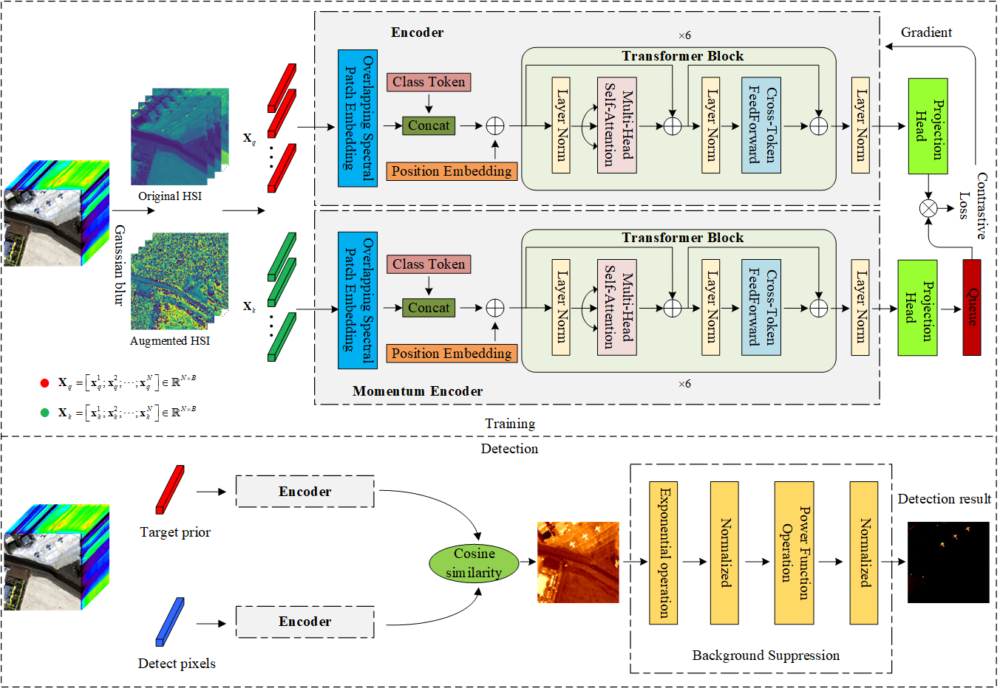

# MCLT
# An Unsupervised Momentum Contrastive Learning based Transformer Network for Hyperspectral Target Detection (JSTARS2024)

Paper web page:[An Unsupervised Momentum Contrastive Learning based Transformer Network for Hyperspectral Target Detection](https://ieeexplore.ieee.org/stamp/stamp.jsp?arnumber=10497838).



# Abstract:
Hyperspectral target detection plays a pivotal role in various civil and military applications. Although recent advancements in deep learning have largely embraced supervised learning approaches, they often hindered by the limited availability of labeled data. Unsupervised learning, therefore, emerges as a promising alternative, yet its potential has not been fully realized in current methodologies. This article proposes an innovative unsupervised learning framework employing a momentum contrastive learningbased transformer network specifically tailored for hyperspectral target detection. The proposed approach innovatively combines transformer-based encoder and momentum encoder networks to enhance feature extraction capabilities, adeptly capturing both local spectral details and long-range spectral dependencies through the novel overlapping spectral patch embedding and a cross-token feedforward layer. This dual-encoder design significantly improves the model’s ability to discern relevant spectral features amidst complex backgrounds. Through unsupervised momentum contrastive learning, a dynamically updated queue of negative sample features is utilized so that the model can demonstrate superior spectral discriminability. This is further bolstered by a unique background suppression mechanism leveraging nonlinear transformations of cosine similarity detection results, with two nonlinearly pull-up operations, significantly enhancing target detection sensitivity, where the nonlinearly operations are the exponential function with its normalization and the power function with its normalization, respectively. Comparative analysis against seven state-of-the-art hyperspectral target detection methods across four real hyperspectral images demonstrates the effectiveness of the proposed method for hyperspectral target detection, with an increase in detection accuracy and a competitive computational efficiency. An extensive ablation study further validates the critical components of the proposed framework, confirming its comprehensive capability and applicability in hyperspectral target detection scenarios.

# Citation：
Please cite us if our project is helpful to you!

```
@ARTICLE{10497838,
  author={Wang, Yulei and Chen, Xi and Zhao, Enyu and Zhao, Chunhui and Song, Meiping and Yu, Chunyan},
  journal={IEEE Journal of Selected Topics in Applied Earth Observations and Remote Sensing}, 
  title={An Unsupervised Momentum Contrastive Learning Based Transformer Network for Hyperspectral Target Detection}, 
  year={2024},
  volume={17},
  number={},
  pages={9053-9068},
  keywords={Transformers;Object detection;Hyperspectral imaging;Feature extraction;Self-supervised learning;Training;Unsupervised learning;Hyperspectral imagery (HSI);momentum contrastive learning;target detection;transformer;unsupervised learning},
  doi={10.1109/JSTARS.2024.3387985}}
```

# Usage:
```
Run main_mclt.py for model training
Run detection.py for target detection
```
